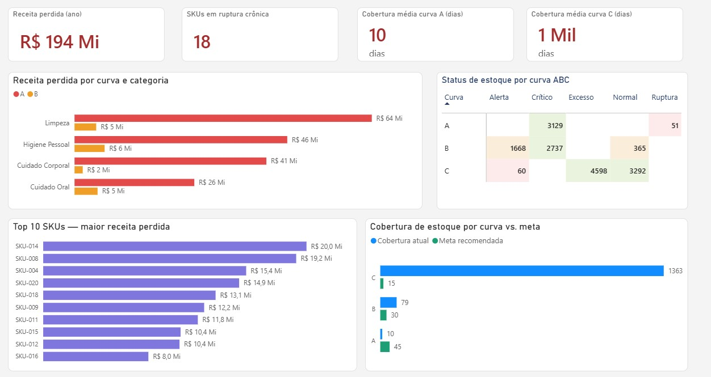
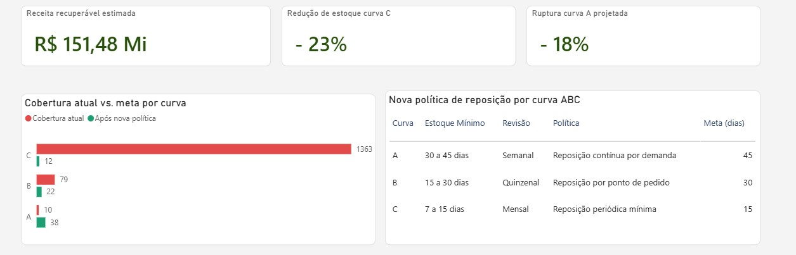

# Dead Stock vs. Stockouts — Distrimax Case Study

Area: Business Intelligence · Continuous Improvement  
Tools: SQL (SQLite) · Power BI · Root Cause Analysis  
Type: Case study with fictitious data based on real distribution problems

---

## Context

Distrimax is a fictitious distributor of hygiene and cleaning products operating across three regions of Brazil, South, Northeast and Southeast, with annual revenue of R$ 18 million and approximately 850 active SKUs, serving pharmacy and supermarket chains.

The operations manager faced two simultaneous complaints that seemed to contradict each other:

The sales team reported losing sales due to out-of-stock items, products running out before replenishment orders arrived. The finance team complained that capital was stuck in inventory, slow-moving products taking up space and money with no return.

**How can a company have excess inventory and stockouts at the same time?**

The initial hypothesis pointed to a simple cause: Distrimax treated all SKUs equally, with the same replenishment lead time and the same minimum stock level, without considering that 20% of SKUs accounted for 80% of revenue.

---

## Dataset

The dataset was built with fictitious but realistic data, structured in 4 tables:

| Table | Description | Rows |
|-------|-------------|------|
| `dim_sku_ok` | 100 SKUs with ABC curve, cost and replenishment policy | 100 |
| `fato_vendas_ok` | Monthly sales by SKU and region with lost revenue due to stockouts | 3,600 |
| `fato_estoque_ok` | Weekly inventory snapshot by SKU and region with status | 15,900 |
| `dim_meta_ok` | Ideal replenishment policy by ABC curve | 3 |

---

## SQL Analysis

Queries were developed in SQLiteOnline and documented with an explanation of each technique used.

### Query 1 — ABC Curve
SKU classification by share of total revenue, using window functions to calculate the cumulative percentage.

```sql
SELECT
    s.sku_id,
    s.descricao,
    s.curva_abc,
    ROUND(SUM(v.receita_realizada), 2) AS total_revenue,
    ROUND(SUM(v.receita_realizada) * 100.0 /
          SUM(SUM(v.receita_realizada)) OVER (), 2) AS pct_revenue,
    ROUND(SUM(SUM(v.receita_realizada)) OVER (
          ORDER BY SUM(v.receita_realizada) DESC
          ROWS BETWEEN UNBOUNDED PRECEDING
          AND CURRENT ROW) * 100.0 /
          SUM(SUM(v.receita_realizada)) OVER (), 2) AS cumulative_pct
FROM fato_vendas_ok v
JOIN dim_sku_ok s ON v.sku_id = s.sku_id
GROUP BY s.sku_id, s.descricao, s.curva_abc
ORDER BY total_revenue DESC;
```

### Query 2 — Stockout Ranking
Frequency of critical and stockout status by SKU and region, using CASE WHEN to count occurrences by status type.

```sql
SELECT
    e.sku_id,
    s.curva_abc,
    e.regiao,
    COUNT(*) AS total_records,
    SUM(CASE WHEN e.status_estoque = 'Ruptura' THEN 1 ELSE 0 END) AS stockout_count,
    SUM(CASE WHEN e.status_estoque = 'Crítico' THEN 1 ELSE 0 END) AS critical_count,
    ROUND(SUM(CASE WHEN e.status_estoque = 'Ruptura'
              THEN 1.0 ELSE 0 END) * 100 / COUNT(*), 1) AS stockout_pct
FROM fato_estoque_ok e
JOIN dim_sku_ok s ON e.sku_id = s.sku_id
GROUP BY e.sku_id, s.curva_abc, e.regiao
ORDER BY stockout_count DESC;
```

### Query 3 — Lost Revenue
Financial impact of stockouts by ABC curve and category, revealing that C-curve items never lose revenue, as inventory is always in excess.

```sql
SELECT
    s.curva_abc,
    s.categoria,
    ROUND(SUM(v.receita_perdida), 2) AS total_lost,
    ROUND(SUM(v.receita_realizada), 2) AS total_realized,
    ROUND(SUM(v.receita_perdida) * 100.0 /
          (SUM(v.receita_perdida) + SUM(v.receita_realizada)), 2) AS loss_pct
FROM fato_vendas_ok v
JOIN dim_sku_ok s ON v.sku_id = s.sku_id
GROUP BY s.curva_abc, s.categoria
ORDER BY total_lost DESC;
```

### Query 4 — Current Stock vs. Ideal Policy
Comparison between actual coverage and recommended target, the query that proves the misalignment of the current policy.

```sql
SELECT
    s.curva_abc,
    ROUND(AVG(e.dias_cobertura), 1) AS current_coverage_days,
    ROUND(AVG(e.estoque_fisico), 0) AS avg_stock,
    m.estoque_minimo_recomendado_dias AS coverage_target,
    m.frequencia_revisao AS review_frequency,
    m.politica_reposicao AS replenishment_policy
FROM fato_estoque_ok e
JOIN dim_sku_ok s ON e.sku_id = s.sku_id
JOIN dim_meta_ok m ON s.curva_abc = m.curva_abc
GROUP BY s.curva_abc, m.estoque_minimo_recomendado_dias,
         m.frequencia_revisao, m.politica_reposicao
ORDER BY s.curva_abc;
```

---

## Diagnosis

### ABC Curve
The 20 A-curve SKUs represent approximately 80% of total revenue, yet operate with an average coverage of only 10 days, well below the 30 to 45-day target.

### Ishikawa Diagram
Root cause analysis for stockouts in A-curve items:

| Category | Identified Cause |
|----------|-----------------|
| Method | Uniform replenishment policy applied to all SKUs |
| Measurement | Minimum stock calculated without considering actual turnover |
| Management | No periodic review process by ABC curve |
| Material | Replenishment lead time underestimated for high-demand items |

### GUT Matrix

| Problem | Gravity | Urgency | Trend | GUT Score |
|---------|---------|---------|-------|-----------|
| A-curve stockouts | 5 | 5 | 5 | 125 |
| C-curve excess stock | 4 | 3 | 4 | 48 |
| Uniform replenishment policy | 5 | 4 | 5 | 100 |

---

## Power BI Dashboard

### Page 1 — Diagnosis



Key findings:

- R$ 194M in lost revenue due to stockouts during the year
- A-curve with 10 days of average coverage against a 30 to 45-day target
- C-curve with 1,363 days of coverage, capital completely tied up
- Cleaning category concentrates the highest loss: R$ 64M

### Page 2 — Solution



Projected impact with new policy:

- A-curve: coverage increases from 10 to 38 days
- B-curve: coverage adjusts from 79 to 22 days
- C-curve: coverage reduces from 1,363 to 12 days

---

## Solution — New Replenishment Policy

| Curve | Minimum Stock | Review Frequency | Policy | Target (days) |
|-------|--------------|-----------------|--------|---------------|
| A | 30 to 45 days | Weekly | Continuous demand replenishment | 45 |
| B | 15 to 30 days | Bi-weekly | Reorder point replenishment | 30 |
| C | 7 to 15 days | Monthly | Minimum periodic replenishment | 15 |

Estimated impact:

- Recoverable revenue: approximately 78% of lost revenue on A-curve items
- C-curve stock reduction: 23%
- A-curve stockout reduction: 18%

---

## Repository Structure

```
distrimax-case/
├── README.md
├── README_EN.md
├── data/
│   ├── dim_sku_ok.csv
│   ├── fato_vendas_ok.csv
│   ├── fato_estoque_ok.csv
│   └── dim_meta_ok.csv
├── sql/
│   └── queries_distrimax.sql
└── assets/
    ├── dashboard_diagnostico.png
    └── dashboard_solucao.png
```

---

## Author

Developed as a portfolio case study in BI and Continuous Improvement by Monithelly Simões.

[LinkedIn](https://www.linkedin.com/in/monithellysimoes)
